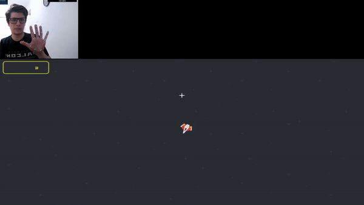

# SpaceGame
### MiniGame with motion capture. 

A single player shooting minigame wich use ML to track hand position through a webcam and uses for gamecontrol.

The Game itself is coded in Processing and communicates through OSC protocol with a hand tracker. 

How? 
First, reads data from HandPose OSC (wich do the actual tracking). Then two models trained in Wekinator are used to normalize the position data and to classify the hand gesture. Then the controls are set in Processing based on hand position (motion) and hand gesture (enable shooting action).

- Graphics from Kenney. Great work [here](www.kenney.nl).
- HandPose OSC [here.](https://github.com/faaip/HandPose-OSC/releases)
- Wekinator from Rebecca Fiebrink [here.](http://www.wekinator.org/)
